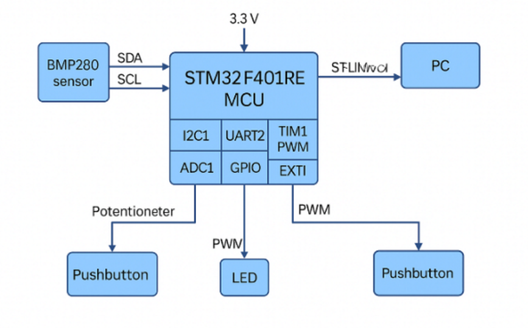

# Smart Environmental Node on STM32F401RE

Goal: Build a polished, interview-ready embedded systems demo on the Nucleo-F401RE board that exercises a broad range of MCU peripherals and good engineering practices (architecture, documentation, version control, testing, demo script). Use the BMP280 environmental sensor (temp + pressure) plus a small set of low-cost components (LEDs, pushbuttons, potentiometer, maybe buzzer or small fan) to create a Smart Environmental Node you can extend with data logging, alerts, and optional Edge/ML hooks.

1. Elevator Pitch (Use in Interviews)

“I designed and implemented a modular embedded system on an STM32F401RE Nucleo board that reads temperature and pressure from a BMP280 over I²C, logs and streams data over UART/USB, shows live status via LEDs/PWM, and demonstrates interrupts, DMA, timers, ADC-based user input, low-power modes, and an RTOS option. I produced SysML-style diagrams, hardware wiring drawings, and a reproducible GitHub repo with build instructions, test logs, and demo videos.”

Keep this ~30 sec. Be ready to expand to 2 min using the topics below.

2. High-Level Feature Coverage Map

Feature Area

Implemented Element

Why It Matters in Interviews

Project Module

Status

Digital I/O (GPIO)

LEDs, pushbutton

Basic embedded bring-up, debugging

drivers/gpio

Planned

I²C

BMP280 sensor

Real sensor interface, register read/write, calibration

drivers/bmp280

Planned

UART (Virtual COM)

Data log to PC terminal

Debug + host tools + scripting

drivers/uart_log

Planned

Timers

Periodic sampling, PWM LED dim

Scheduling & signal generation

core/timers

Planned

PWM

LED brightness proportional to temp

Demonstrates timer compare + scaling

app/led_feedback

Planned

ADC

Potentiometer = sample rate or alert threshold

Mixed-signal integration

drivers/adc_pot

Planned

EXTI Interrupts

Pushbutton triggers forced sample / mode change

Interrupt-driven design

core/interrupts

Planned

DMA

Burst UART logging; optional I²C+DMA

Performance, CPU offload

core/dma

Optional+

Low-Power

Sleep between samples; wake on timer/EXTI

Power management awareness

core/power

Stretch

RTOS (FreeRTOS)

Sensor task, UI task, comms task

Real-world multitasking

rtos/

Stretch

Error Handling

Sensor fault detect, retry, error LED

Robustness story

core/error

Planned

Configuration Persistence

Threshold store in flash/EEPROM emu

Non-volatile settings

services/config_store

Stretch

Legend: Planned = baseline MVP; Optional+ = nice-to-have; Stretch = add if time allows.

3. Incremental Build Roadmap (Sprints)

Each Sprint should end with code in Git, tagged, and a README update. Commit early, commit often.

Sprint 0 – Environment Setup & Repo Skeleton

Install STM32CubeIDE + STM32CubeMX.

Confirm board connects, debug works (LED blink).

Create GitHub repo: /hw, /fw, /docs, /scripts, /tests.

Add README skeleton + build instructions.

Sprint 1 – GPIO Bring-Up

Blink on-board LED (LD2) at 1 Hz.

Read user button (on Nucleo) debounced in software.

Add simple CLI over UART to toggle LED.

Sprint 2 – I²C & BMP280 Driver (Polled)

Wire BMP280 to Nucleo I²C pins (see §6 Hardware Wiring).

Read chip ID; implement calibration read; raw -> compensated temp/pressure.

Print readings every 1s.

Sprint 3 – UART Logging & Simple Protocol

Wrap printf retarget or ring-buffer transmit.

Add CSV output: timestamp_ms,temp_c,press_pa.

Add human-readable command menu from host terminal.

Sprint 4 – Timers & Periodic Scheduler

Use hardware timer interrupt to set sample flag at configurable rate.

Main loop consumes flag; decouple sensor timing from HAL_Delay.

Sprint 5 – PWM LED Feedback

Map temperature to LED brightness (cool=dim, warm=bright).

Use timer PWM channel; update duty cycle when new sample arrives.

Sprint 6 – ADC Potentiometer Input

Add pot to analog pin; scale 0–3.3V to 0–100%.

Use pot to control sampling interval OR temperature alert threshold.

Sprint 7 – Interrupts (EXTI) for Pushbutton

Short press: force immediate sensor sample.

Long press: cycle operating modes (stream, threshold alert, low-power).

Sprint 8 – DMA Enhancements

UART TX via DMA to reduce CPU load during burst logging.

Optional: I²C+DMA (depends on HAL support & complexity comfort).

Sprint 9 – Low-Power Mode Demo

Sleep MCU between samples; wake by timer or pushbutton.

Measure current (if you have a USB power meter).

Sprint 10 – RTOS Refactor (Stretch)

FreeRTOS w/ 3 tasks: Sensor, UI, Comms.

Queues for messages; event flags for alerts.

Sprint 11 – Documentation & Diagrams

System context, HW block, wiring, SW architecture, state machine.

Include short design rationale bullets.

Sprint 12 – Interview Packaging

Clean README w/ quick-start.

Screenshots, short demo video (phone camera OK).

Talking points cheat sheet.

4. Minimal Viable Demo (MVP)

If time is short, target these by default:

BMP280 readout printed over serial.

LED brightness tracks temperature via PWM.

Pushbutton triggers sample.

Pot sets sample rate.

Error blink pattern if sensor missing. This covers GPIO, I²C, UART, PWM, ADC, interrupts – already impressive.

5. Stretch Idea: "Comfort Monitor" Scenario

Add a “Comfort Index” computed from temperature + pressure trend; alert when outside comfort range (LED flashes, buzzer chirp, serial warning). Good story: environment chambers, avionics testing lab (links to your background).

6. Hardware Planning

6.1 Core Parts You Already Have

Nucleo-F401RE board.

BMP280 breakout (assume 3.3V-compatible; check board silk: VIN 3V3/5V tolerant?).

Breadboard + jumpers.

LEDs + resistors (220Ω–1kΩ typical).

Pushbuttons (momentary, normally open).

6.2 Recommended Add-Ons (Low Cost)

10k potentiometer (linear) + 3-pin header.

Small passive buzzer OR small 5V fan (with transistor + diode) for PWM/driver example.

USB power meter (optional, for low-power discussion).

6.3 Electrical Notes

Power the BMP280 from 3.3V to avoid level shifting complexity.

Use board 3V3 and GND rails to breadboard.

I²C: Pull-ups often present on breakout; if unstable, add 4.7kΩ pull-ups to 3.3V.

Series resistor each LED; tie cathode to GND (or anode to VCC depending on scheme) – be consistent.

Pot wiring: one end to 3.3V, other to GND, wiper to ADC pin.

7. Pin Assignment (Proposed)

(Adjust if conflicts in CubeMX.)

Function

STM32 Pin

Nucleo Pin Header

Notes

I²C1_SCL

PB8

D15

Connect to BMP280 SCL

I²C1_SDA

PB9

D14

Connect to BMP280 SDA

LED_PWM

PA8 (TIM1_CH1)

D7

External LED brightness

Pot_ADC

PA0 (ADC_IN0)

A0

Pot wiper

User Button

PC13

On-board

Already wired; also break out ext button if desired

UART2_TX

PA2

ST-LINK VCP to PC

Use built-in virtual COM

UART2_RX

PA3

ST-LINK VCP to PC

Buzzer/Fan_PWM

PB6 (TIM4_CH1)

D10 (alt)

Optional

Check CubeMX alternate function mapping conflicts before finalizing.

8. Firmware Architecture

fw/
 ├─ Core/                # auto-generated by CubeIDE
 ├─ Drivers/
 │    ├─ bsp/            # board support: leds, button, pot
 │    ├─ sensors/
 │    │    └─ bmp280/
 │    ├─ comms/
 │    │    └─ uart_log.c
 │    └─ ...
 ├─ App/
 │    ├─ app_main.c      # high-level state machine
 │    ├─ app_modes.c     # streaming, threshold, low-power
 │    └─ app_cli.c       # simple serial commands
 ├─ CoreServices/
 │    ├─ scheduler.c     # timer tick, tasks
 │    ├─ error_mgr.c     # error codes -> LED patterns/logs
 │    └─ config_store.c  # (stretch) flash params
 └─ rtos/                # (stretch) FreeRTOS wrappers

Layering Concept:

HAL Layer: Generated from CubeMX; low-level init.

Driver Layer: Thin wrappers that abstract HAL specifics and expose clean APIs.

Service Layer: Logic that combines drivers (e.g., periodic sampling scheduler).

Application Layer: User-visible behavior, modes, CLI, presentation.

9. Data Flow Overview

Timer tick -> set sample_request flag.

Sensor task (or main loop) reads BMP280 via I²C.

Apply calibration (if not using library) -> engineering units.

Update current values; push to UART log queue.

Convert temperature to PWM duty cycle -> LED.

Compare temperature to threshold (pot/CLI config) -> alert.

On error (I²C fail, ID mismatch): error_mgr triggers blink pattern + log.

10. System State Machine (MVP)

States:

INIT: Clock/config, driver init, self-test.

STREAM: Periodic sample & UART output.

THRESHOLD: Only output when value crosses threshold; LED color/pattern.

LOW_POWER: Sleep; wake on timer or button. Transitions triggered by button long-press or CLI commands.

11. Testing Strategy

Bring-Up Tests

Power-on: Board enumerates USB COM; LED heartbeat.

GPIO test: Toggle external LED via CLI.

I²C scan: detect BMP280 address.

Read chip ID = 0x58 expected.

Functional Tests

Compare BMP280 temperature vs room thermometer.

Sweep pot; confirm sample rate changes (observe UART timestamps).

Button short press -> immediate reading.

Disconnect BMP280 -> error pattern.

Performance / Robustness

24h continuous run logging to PC; look for I²C errors.

Rapid button presses; confirm no lockups (debounce + queueing).

Optional: Over-temp simulation (touch sensor lightly) to test alert.

12. Documentation You Should Produce

Create these in /docs and export to PDF/PNG for your repo.

12.1 System Context Diagram

Shows relationship: User PC ↔ Nucleo Board ↔ Sensors / Actuators ↔ Environment.

12.2 Hardware Block Diagram

Blocks: STM32F401RE MCU, ST-LINK, Power, I²C sensor bus, GPIO lines, ADC pot, PWM LED, Optional buzzer/fan. Arrows labeled with signal direction + voltage.

12.3 Breadboard Wiring Diagram (Fritzing-style)

Use Fritzing (free) or Tinkercad Circuits for drag-drop components; export image.

12.4 Pin Mapping Table (already above) – export nicely formatted.

12.5 Software Architecture Diagram

Layered boxes (HAL → Drivers → Services → App). Add RTOS tasks if used.

12.6 State Machine Diagram

INIT → STREAM ↔ THRESHOLD ↔ LOW_POWER; button/CLI events.

12.7 Data Sequence Diagram (optional)

Timer ISR → Set flag → Main loop read sensor → UART send.

13. Free / Low-Cost Diagramming Tools

You said you do not have Cameo; below are good alternatives:

General Block & SysML-Lite Diagrams

diagrams.net (draw.io) – browser-based, free, great for block/state/flow diagrams; export PNG/SVG.

yEd Live – auto-layout graphs; good for state machines.

PlantUML – text-to-diagram; good for sequence/state diagrams; version control friendly.

Mermaid (Markdown) – quick diagrams inline in GitHub READMEs.

Electronics Wiring

Fritzing (desktop; free/low-cost) – intuitive breadboard, schematic, PCB views.

Wokwi (online simulator) – may not have BMP280 but good for teaching layout concepts.

Pick 1 general diagram tool + Fritzing for wiring.

14. Diagram File Naming Convention

docs/
 ├─ fig_context.svg
 ├─ fig_hw_block.svg
 ├─ fig_pinmap.csv
 ├─ fig_breadboard.png
 ├─ fig_sw_layers.svg
 ├─ fig_state_machine.svg
 ├─ fig_sequence_sampling.svg

Use *.svg when possible (scales nicely in README).

15. Recommended README Structure

Project Title + Hero Image.

Short Demo GIF / Photo of setup.

Elevator Pitch.

Quick Start (clone, open CubeIDE, build, connect serial @ 115200, run).

Hardware List & Wiring Table.

Build Config (CubeMX version, HAL, toolchain).

Features Implemented (checkbox list).

Usage – CLI commands, modes.

Project Architecture – link diagrams.

Test Results – short bullets.

Next Steps / Stretch Goals.

16. Coding Conventions & Tips

Use uint32_t etc (fixed types), not bare int.

Centralized error_t enum; map to LED blink codes.

Avoid blocking delays in main loop; use flags or RTOS.

Separate hardware init from application logic.

Add Doxygen-style comments for public driver APIs.

Wrap HAL status -> your status codes; never leak HAL details above driver layer.

17. BMP280 Driver Outline

bmp280.h

#ifndef BMP280_H
#define BMP280_H
#include "stm32f4xx_hal.h"

typedef struct {
    float temperature_c;
    float pressure_pa;
    uint8_t ok;          // 1=valid, 0=error
} bmp280_data_t;

HAL_StatusTypeDef BMP280_Init(I2C_HandleTypeDef *hi2c);
HAL_StatusTypeDef BMP280_ReadData(I2C_HandleTypeDef *hi2c, bmp280_data_t *out);

#endif

bmp280.c (skeleton pseudocode)

#define BMP280_ADDR  (0x76 << 1)  // adjust if your board uses 0x77
#define BMP280_REG_ID 0xD0
...

static struct { /* calib values */ } cal;
static int32_t t_fine;

static HAL_StatusTypeDef bmp280_read_calib(...);
static int32_t bmp280_comp_temp(...);
static uint32_t bmp280_comp_press(...);

HAL_StatusTypeDef BMP280_Init(I2C_HandleTypeDef *hi2c) {
    // read ID; must be 0x58
    // read calib block
    // configure oversampling + normal/forced mode
}

HAL_StatusTypeDef BMP280_ReadData(I2C_HandleTypeDef *hi2c, bmp280_data_t *out) {
    // read raw temp/press registers in burst
    // apply compensation
    // fill out struct
}

18. CLI Command Ideas (UART Terminal)

Command

Action

h

help menu

s

single sample now

r <ms>

set sample period

t <°C>

set temperature threshold

m <mode>

0=stream,1=threshold,2=lowpower

v

print firmware version/build time

p

print current sensor values

19. Demo Script for Interview (5 min)

Hold board to camera; show wiring.

Open serial terminal; power cycle board; watch banner.

Show streaming temp/pressure.

Turn pot; sample rate change visible.

Press button; immediate sample.

Warm sensor (touch lightly) to cross threshold; LED ramps / alert message.

Disconnect BMP280; show error detection.

(Optional) Enter low-power mode; show reduced activity.

20. Tracking Your Progress

Use a simple markdown checklist in your repo root:

## Build Progress
- [ ] Repo created
- [ ] LED blink
- [ ] UART printf works
- [ ] BMP280 ID read
- [ ] Sensor data compensated
- [ ] Timer-based sampling
- [ ] PWM LED temp bar
- [ ] Pot controls sample rate
- [ ] Pushbutton interrupt
- [ ] Error handling
- [ ] Docs + diagrams
- [ ] Demo video recorded

21. How I Will Support You (Workflow)

You do a small step → show me screenshots/code → I review → we fix → move on.

Suggested cycle:

You tell me the current Sprint step & what you tried.

Paste relevant CubeMX screenshots + code snippets.

I give you exact pin selections, code edits, and test procedure.

You test & report results.

We document in README as we go.
